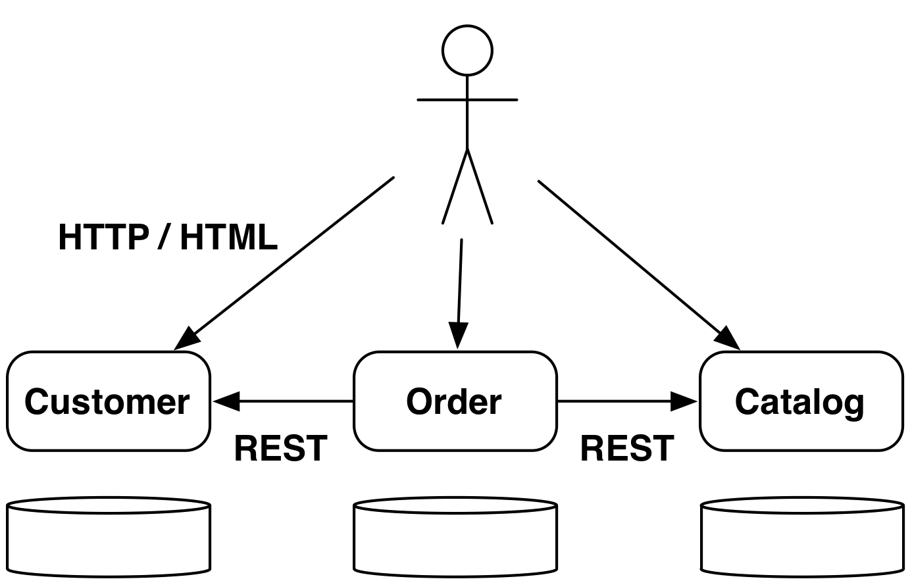
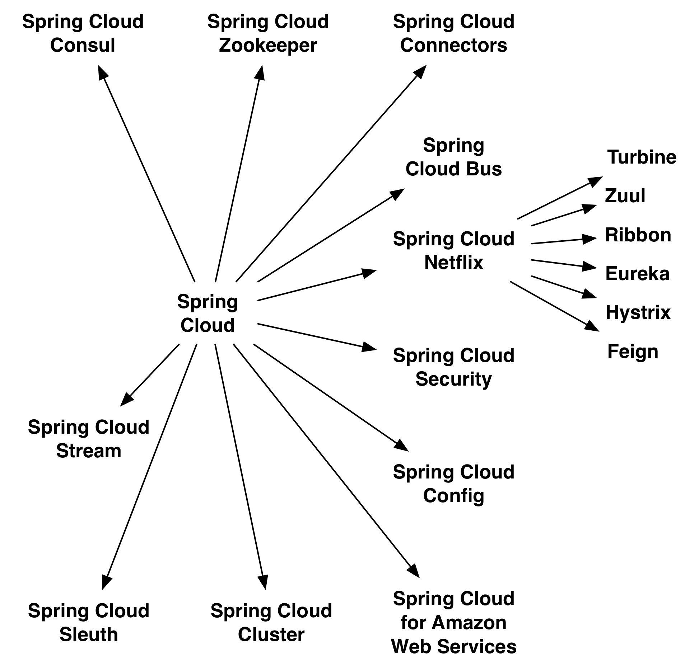
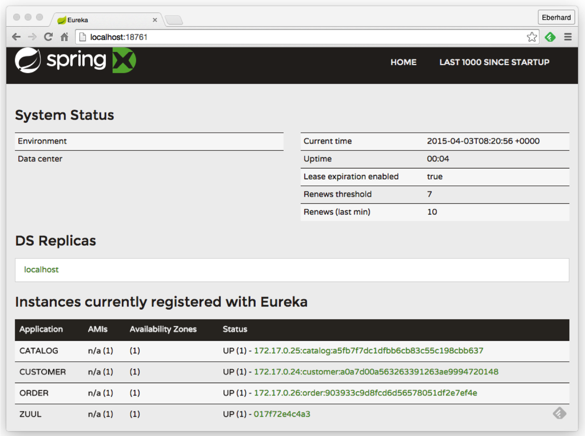
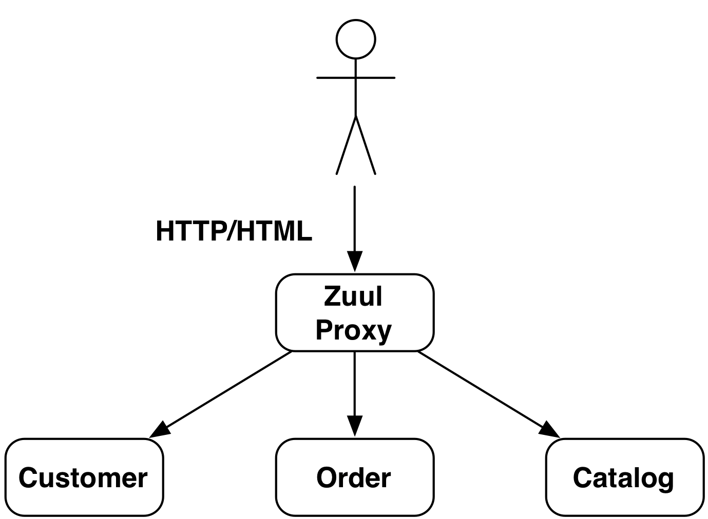

:revealjs_theme: conference
:revealjs_customtheme: assets/css/conference.css
:revealjs_width: 1000
// The valid options are coderay, highlightjs, prettify, and pygments
// :source-highlighter: pygments
// :pygments-style: tango
:source-highlighter: highlightjs
:speaker: Krzysztof Sobkowiak
:speaker-title: The Apache Software Foundation Member, Senior Solution Architect at Capgemini
:speaker-email: krzys.sobkowiak@gmail.com
:speaker-blog: http://sobkowiak.github.io
:speaker-twitter: http://twitter.com/ksobkowiak[@ksobkowiak]
:template-images-dir: assets/images

// ***************************************************************************

= Microservices With Spring Boot and Spring Cloud

[.cover]
--
Example for a Microservices-based Architecture

[.newline]
APPS Evolve! Summit 2016 +
Frankfurt, 04 March 2016

[.newline]
{speaker}
[.speaker-title]

--

// ***************************************************************************

== Outline

[.noredheader,cols="50%,50%"]
|===
a|
* Domain Architecture
* Basic Technologies
* Build & Deployment
* Service Discovery
a|
* Communication
* Resilience
* Load Balancing
|
|===

// ***************************************************************************

== Domain Architecture

// ***************************************************************************

=== Three Microservices

[.centering]
--

--

// ***************************************************************************

=== Architecture Considerations

* Separate data storages
* Lots of communication
* Bounded Context
* Don't modularize microservices by data

// ***************************************************************************

== Basic Technologies

// ***************************************************************************

=== HSQL Database

* In memory database
* Not really suited for production use
* Keeps the example application easy

// ***************************************************************************

=== Spring Data JPA

* Provides support to build repositories based on Spring and JPA
* Support for Querydsl predicates and thus type-safe JPA queries
* Pagination support, dynamic query execution, ability to integrate custom data access code

[source, java]
----
public interface PersonRepository extends PagingAndSortingRepository<Person, Long> {
  List<Person> findByLastName(@Param("name") String name);
}
----

// ***************************************************************************

=== Spring Data REST

* Provides the domain objects with little effort via REST
* Can hide certain data elements
* Can be configured flexibly
* Tight coupling between the internal model and the interface can be decoupled

[source, java]
----
@RepositoryRestResource(collectionResourceRel = "people", path = "people")
public interface PersonRepository extends PagingAndSortingRepository<Person, Long> {
  List<Person> findByLastName(@Param("name") String name);
}
----

// ***************************************************************************

=== Spring Boot

[.noredheader,cols="50%,50%"]
|===
a|
* It can be pretty small...
* Predefined packages/starters available
* Can generate WAR or JAR file
a|
[source, java]
----
@RestController
@SpringBootApplication
public class ControllerAndMain {

  @RequestMapping("/")
  public String hello() {
    return "hello";
  }

  public static void main(String[] args) {
    SpringApplication.run(
      ControllerAndMain.class, args);
  }
}
---- |
|===

// ***************************************************************************

=== !

[.centering]
--
[.large-text]
Writing a single service is nice...
--

// ***************************************************************************

=== !

[.centering]
--
[.large-text]
...but no microservice is an island
--

// ***************************************************************************

=== Challenges of Distributed Systems

* Configuration management
* Service registration & discovery
* Routing & balancing
* Fault tolerance (Circuit Breakers!)
* Monitoring
* Concurrent API aggregation & transformation

// ***************************************************************************

=== Spring Cloud

[.centering]
--

--

// ***************************************************************************

=== Spring Cloud Components

* *Security* - supports the implementation of security mechanisms
* *Config* - centralizes and dynamically adjusts the configuration
* *Bus* - sends dynamic configuration changes for Spring Cloud Config
* *Sleuth* - distributed tracing with tools like Zipkin or Htrace
* *Zookeeper* - supports Apache Zookeeper
* *Consult* - facilitates Services Discovery using Consul
* *Cluster* - implements leader election and stateful patterns using technologies
like Zookeeper or Consul
* *Stream* - supports messaging using Redis, Rabbit or Kafka

// ***************************************************************************

=== Spring Cloud Netflix

* *Zuul* - routing
* *Ribbon* - Load Balancer.
* *Hystrix* - resilience in Microservices.
* *Turbine* -  can consolidate monitoring data from different Hystrix servers.
* *Feign* -  option for an easier implementation of REST clients
* *Eureka* - Service Discovery

// ***************************************************************************

== Service Discovery

// ***************************************************************************

=== Why Eureka?

* REST based service registry
* Supports replication
* Caches on the client
* Resilient
* Fast, but not consistent
* Foundation for other services

// ***************************************************************************

=== Eureka Client

* Registers automatically with the Eureka server under a defined name
* Can access other Microservices
* Integrates Load Balancing with Ribbon using
** `DiscoveryClient`, `FeignClient`
** Eureka aware `RestTemplate` (sample later)
* `@EnableDiscoveryClient` or `@EnableEurekaClient`
* Dependency to `spring-cloud-starter-eureka`

[source]
----
eureka.client.serviceUrl.defaultZone=http://eureka:8761/eureka/
eureka.instance.leaseRenewalIntervalInSeconds=5
spring.application.name=catalog
eureka.instance.metadataMap.instanceId=catalog:${random.value}
eureka.instance.preferIpAddress=true
----

// ***************************************************************************

=== Eureka Server

* `@EnableEurekaServer`
* Dependency to `cloud-starter-eureka-server`

[source, java]
----
@EnableEurekaServer
@EnableAutoConfiguration
public class EurekaApplication {
  public static void main(String[] args) {
    SpringApplication.run(EurekaApplication.class, args);
  }
}
----

// ***************************************************************************

=== Eureka Dashboard

[.centering]
--

--

// ***************************************************************************

== Load Balancing

// ***************************************************************************

=== Ribbon

* Decentralized, client side Load Balancing
* No bottle neck
* Resilient
* Data might be inconsistent

// ***************************************************************************

=== `RestTemplate` & Load Balancing

* `@RibbonClient`
* Dependency to `spring-cloud-starter-ribbon`

[source, java]
----
@RibbonClient(name = "ribbonApp")
... // Left out other Spring Cloud / Boot Annotations
public class RibbonApp {

  @Autowired
  private RestTemplate restTemplate;

  public void callMicroservice() {
    Store store = restTemplate.getForObject("http://stores/store/1", Store.class);
  }
}
----

// ***************************************************************************

== Communication

// ***************************************************************************

=== Zuul Routing

[.noredheader,cols="50%,50%"]
|===
a|
* One URL to outside
* Internal many microservices
* Maps route to server registered on Eureka, e.g. `/customer/**` to `CUSTOMER`
* Allows to internally change the structure of the Microservices
* REST or HTML gui
^a|  |
|===

* `@EnableZuulProxy`, dependency to `spring-cloud-starter-zuul`
* Alternatively `@EnableZuulServer` - no routing, uses filters

// ***************************************************************************

== Resilience

// ***************************************************************************

// ***************************************************************************

// ***************************************************************************

// ***************************************************************************

== !

[.thanks]
--
image:{template-images-dir}/smile.png[]

+++<h1>Thanks!</h1>+++
[.underline]
image:{template-images-dir}/underline.png[]

[.large-text]
Any questions?
--
// ***************************************************************************
